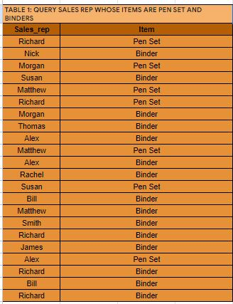
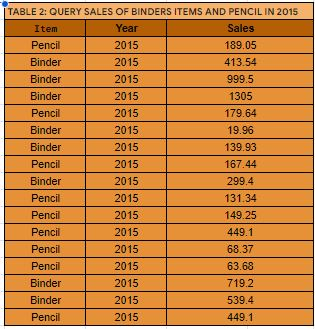
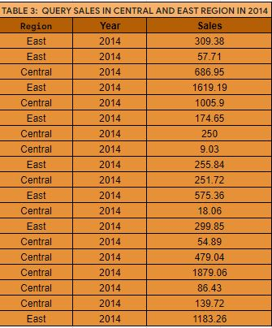
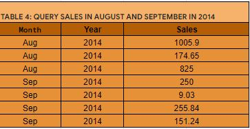
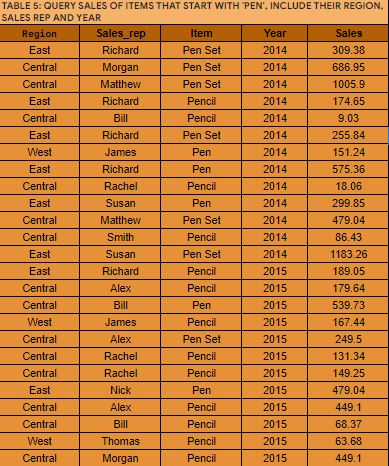
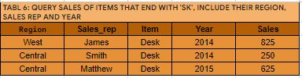

# Google Query Project

This project was done using Google sheet

---

## **Project Outline**

- [Query 1](#Query-1)
- [Query 2](#Query-2)
- [Query 3](#Query-3)
- [Query 4](#Query-4)
- [Query 5](#Query-5)
- [Query 6](#Query-6)
   
---

## Query 1
This section query the sales rep whose items are pen set and binder

```
=QUERY(A1:H44,"SELECT B,C WHERE C='Pen Set', OR C='Binder'", 1)
```

## Result


---

## Query 2
This section query the sales of binder items and pencil in 2015

```
=QUERY(A1:H44,"SELECT C,F,H WHERE (C='Pencil', OR C='Binder') AND F=2015", 1)
```
## Result


---

## Query 3
This section query the sales in Central and East region in 2014

```
=QUERY(A1:H44,"SELECT A,F,H WHERE (C='Central', OR C='East') AND F=2014", 1)
```
## Result


---

## Query 4
This section query the sales in August and September 2014

```
=QUERY(A1:H44,"SELECT E,F,H WHERE (C='Aug', OR C='Sep') AND F=2014", 1)
```
## Result


---

## Query 5
This section query the sales of items that start with Pen, include their region, sales rep and year

```
=QUERY(A1:H44,"SELECT A,B,C,F,H WHERE C LIKE 'Pen%'", 1)
```
## Result


---

## Query 6
This section query the sales of items that end with ‘sk’, include their region, sales rep and year

```
=QUERY(A1:H44,"SELECT A,B,C,F,H WHERE C LIKE '%sk'", 1)
```
## Result


---
